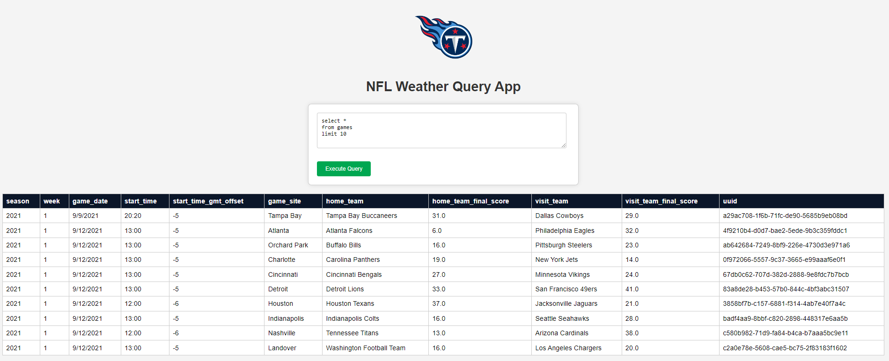

# NFL Weather Data Integration App

This project integrates game day weather data into an internal application for NFL games. The application retrieves historical weather data using the Open Meteo weather API and combines it with NFL game and venue information to provide insights through SQL queries. The project is containerized using Docker for easy setup and deployment.



## Project Structure

```
/flask_nfl_weather_app
│
├── app
│   ├── __init__.py
│   ├── app.py
│   ├── templates
│   │   └── index.html
│   └── static
│       └── logo.png
├── scripts
│   ├── manifests
│   │   ├── archive.yml
│   │   └── forecast.yml
│   ├── id_generator.py
│   ├── game_venue_matching.py
│   ├── retrieve_weather_data.py
│   ├── setup_database.py
│   ├── generate_db_file.py
│   └── weather_forecast.py
├── data
│   ├── Venues.csv
│   ├── Games.csv
│   ├── games_with_uuids.csv
│   ├── venues_with_uuids.csv
│   ├── games_with_venues.csv
│   ├── hourly_weather.csv
│   ├── daily_weather.csv
│   └── weather_data.db
├── assets
│   └── nfl_weather_query_app.png
├── sql
│   ├── query1.sql
│   ├── query2.sql
│   ├── query3.sql
│   ├── query4.sql
│   └── query5.sql
├── __init__.py
├── Dockerfile
├── requirements.txt
├── .gitattributes
├── .gitignore
└── README.md
```

## Setup and Usage

### Prerequisites

- Docker
- Python 3.9

### Running the Application

1. **Build the Docker Image**:

   ```bash
   docker build -t flask-nfl-weather-app .
   ```

2. **Run the Docker Container**:

   ```bash
   docker run -p 5000:5000 flask-nfl-weather-app
   ```

3. **Access the Application**:

   Open your web browser and navigate to `http://localhost:5000`.

### Scripts Description

1. **id_generator.py**:
   - Generates UUIDs for venues and games based on specific columns.
      - venues: `Name`
      - games: `Season`, `Week`, `Start_Time`, `Game_Site`
   - Saves the updated data to `venues_with_uuids.csv` and `games_with_uuids.csv`.

2. **game_venue_matching.py**:
   - Matches games with venues based on location and team information.
      - First match: Matches `game_site` from `games` with `city` from `venues`.
      - Second match: Checks if `game_site` from `games` is a substring in `teams` from `venues`.
   - Saves the matched data to `games_with_venues.csv`.
   - For special venues such as Tottenham, Mexico City, Wembley, Munich, and Frankfurt, if the game site needs to be matched, the corresponding venue information must be included in the venues.csv file..
   
3. **retrieve_weather_data.py**:
   - Retrieves historical weather data for the games using the Open Meteo weather API.
      - In the API call, the start_date is set to 2 days before the game_date and the end_date is set to 1 day after the game_date.
   - Saves the weather data to `hourly_weather.csv` and `daily_weather.csv`.
   - Run with the argument `--api_type` to specify the type of API to use (e.g., `archive`).

4. **generate_db_file.py**:
   - Loads the weather data and game information into a SQLite database.
   - Saves the database to `weather_data.db`.

5. **setup_database.py**:
   - Runs all the above scripts in the correct order to set up the database.
   - Run with the argument `--api_type` to pass the API type to `retrieve_weather_data.py`.

### Flask Application

The Flask application provides a web interface to execute SQL queries on the SQLite database. 

**app/app.py**:
- Defines routes and functions for the Flask web application.
- Connects to the SQLite database and executes SQL queries.

### SQL Queries

Use the web interface to execute SQL queries on the combined NFL game and weather data. Example queries can include:

- Query 1: Aggregated Weather Conditions for Tennessee Titans Games in 2023
- Query 2: Weather data for Tennessee Titans Post-Game Report
- Query 3: Games with Extreme Weather Conditions
- Query 4: Temperature Impact on Scoring
- Query 5: Weather Variation During Games

### Notes

- Ensure the data files (`Venues.csv`, `Games.csv`) are placed in the `data` directory before running the setup scripts.
- Adjust API request limits and other parameters in the scripts as needed.

## License

This project is licensed under the MIT License. See the LICENSE file for details.

```

This README provides an overview of the project, setup instructions, descriptions of the scripts, and information on how to run the application. If you need any additional information or adjustments, feel free to let me know!